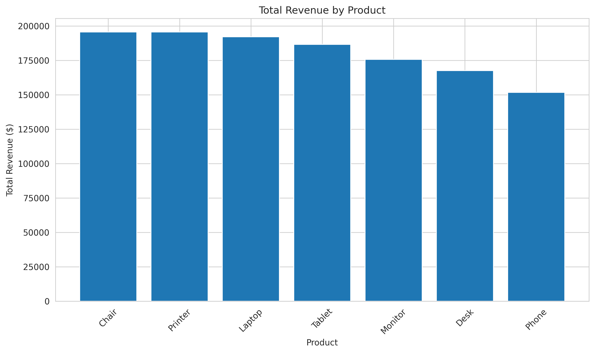
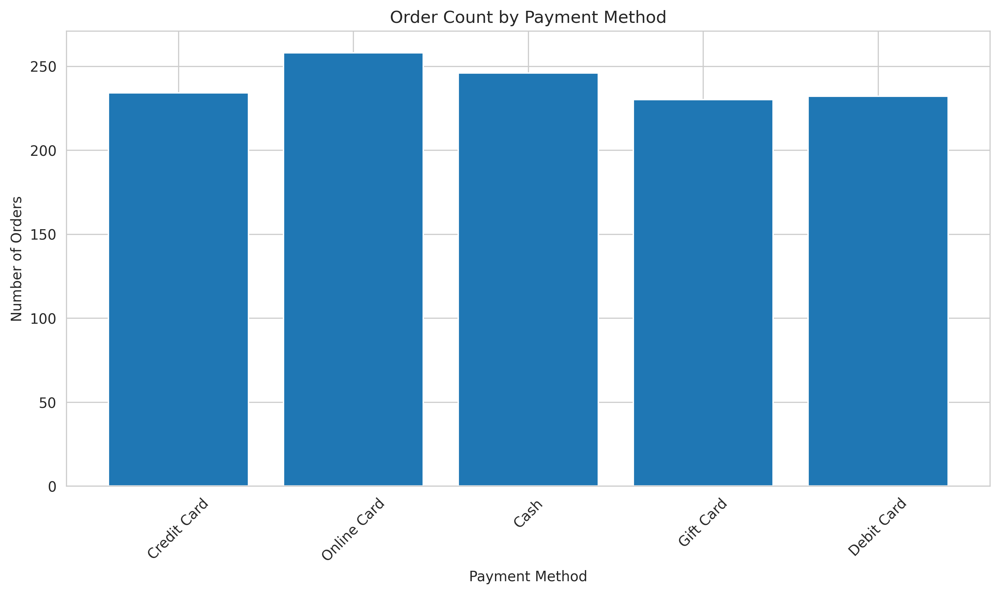
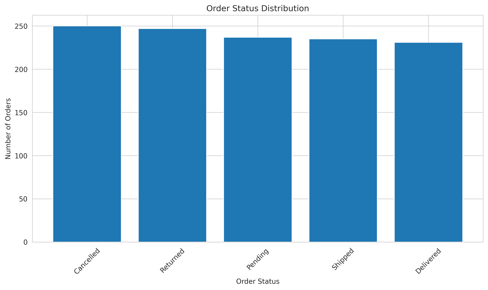
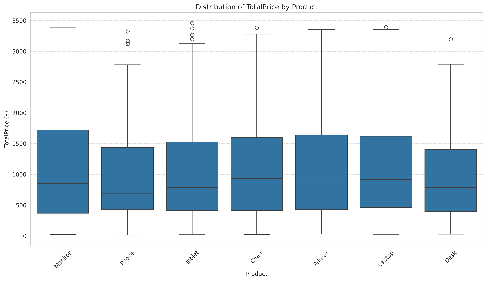

## Project Overview

This project demonstrates proficiency in SQL by writing structured queries to filter, group, and aggregate raw data into actionable business intelligence. The objective was to bridge the gap between massive datasets and specific answers through relational logic.

**Project Goal:** Perform SQL data analysis on an e-commerce dataset to extract business insights.

**Key Skills Applied:**
- SQL query writing (SELECT, WHERE, GROUP BY, HAVING, ORDER BY)
- Aggregate functions (COUNT, SUM, AVG, MIN, MAX)
- Subqueries and CASE statements
- Data analysis and reporting
- SQLite database management
- Python integration with SQL
- Data visualization (bar charts, boxplots)

---

## Dataset Description

The dataset contains **1,001 e-commerce orders** with 14 columns loaded into a SQLite database table called `orders`.

| Column Name | Description | Data Type |
|-------------|-------------|-----------|
| `OrderID` | Unique order identifier | TEXT |
| `Date` | Order date | DATE |
| `CustomerID` | Customer identifier | TEXT |
| `Product` | Product name | TEXT |
| `Quantity` | Number of items ordered | INTEGER |
| `UnitPrice` | Price per unit | REAL |
| `ShippingAddress` | Delivery address | TEXT |
| `PaymentMethod` | Payment method used | TEXT |
| `OrderStatus` | Current order status | TEXT |
| `TrackingNumber` | Shipping tracking number | TEXT |
| `ItemsInCart` | Items added to cart at checkout | INTEGER |
| `CouponCode` | Applied coupon code (if any) | TEXT |
| `ReferralSource` | Customer acquisition source | TEXT |
| `TotalPrice` | Total order value | REAL |

---

## SQL Concepts Executed

| Concept | Description | Query # |
|---------|-------------|---------|
| SELECT | Retrieving specific columns from the database | 1, 2 |
| WHERE (Equality) | Filtering rows by exact matches | 3 |
| WHERE (Comparison) | Filtering rows using >, <, >=, <= operators | 4 |
| WHERE (Pattern) | Pattern matching using LIKE | 5 |
| WHERE (Logical) | AND/OR conditions | 6 |
| GROUP BY | Grouping rows for aggregation | 7-13 |
| COUNT | Counting rows in groups | 7, 10-15 |
| SUM | Summing values in groups | 8, 10-15 |
| AVG | Averaging values in groups | 9, 10-15 |
| MIN/MAX | Finding minimum/maximum values | 10 |
| HAVING | Filtering grouped results | 14, 15 |
| ORDER BY | Sorting results (ASC/DESC) | 16, 17, 18 |
| Subqueries | Nested SELECT statements | 19, 20 |
| CASE | Conditional logic in SQL | 21 |

---

## SQL Queries Executed

| # | Query Description | Key Concept |
|---|-------------------|-------------|
| 1 | First 10 orders | Basic SELECT |
| 2 | Selected columns | Column selection |
| 3 | Product = 'Monitor' | WHERE equality |
| 4 | TotalPrice > 2000 | WHERE comparison |
| 5 | Address LIKE '%Main St' | WHERE pattern matching |
| 6 | Delivered AND Credit Card | WHERE logical (AND/OR) |
| 7 | Product order counts | GROUP BY + COUNT |
| 8 | Product revenue | GROUP BY + SUM |
| 9 | Average order value | GROUP BY + AVG |
| 10 | Product aggregates | Multiple aggregates (COUNT, SUM, AVG, MIN, MAX) |
| 11 | Payment method analysis | GROUP BY analysis |
| 12 | Order status analysis | GROUP BY analysis |
| 13 | Referral source analysis | GROUP BY analysis |
| 14 | Products >= 40 orders | HAVING clause |
| 15 | Avg order > $1,500 | HAVING clause |
| 16 | Lowest value orders | ORDER BY ASC |
| 17 | Highest value orders | ORDER BY DESC |
| 18 | Product ASC, Price DESC | Multiple ORDER BY |
| 19 | Orders above average | Subquery |
| 20 | Products > $50k revenue | Subquery with GROUP BY |
| 21 | Order tier classification | CASE statement |

---

## Sample SQL Queries

### Basic SELECT with WHERE
```sql
SELECT OrderID, Product, Quantity, TotalPrice 
FROM orders 
WHERE TotalPrice > 2000
ORDER BY TotalPrice DESC;
```

### GROUP BY with Aggregates
```sql
SELECT 
    Product,
    COUNT(*) AS OrderCount,
    SUM(TotalPrice) AS TotalRevenue,
    AVG(TotalPrice) AS AvgOrderValue
FROM orders
GROUP BY Product
ORDER BY TotalRevenue DESC;
```

### HAVING Clause
```sql
SELECT 
    Product,
    COUNT(*) AS OrderCount,
    SUM(TotalPrice) AS TotalRevenue
FROM orders
GROUP BY Product
HAVING COUNT(*) >= 40
ORDER BY TotalRevenue DESC;
```

### Subquery
```sql
SELECT OrderID, Product, TotalPrice
FROM orders
WHERE TotalPrice > (SELECT AVG(TotalPrice) FROM orders)
ORDER BY TotalPrice DESC;
```

### CASE Statement
```sql
SELECT 
    OrderID,
    TotalPrice,
    CASE 
        WHEN TotalPrice < 500 THEN 'Low'
        WHEN TotalPrice BETWEEN 500 AND 2000 THEN 'Medium'
        ELSE 'High'
    END AS OrderTier
FROM orders;
```

---

## Key Business Insights

### 1. Product Performance
- **Top Revenue Product**: Monitor generated the highest revenue
- **Most Ordered Product**: Monitor with the highest order count
- **Highest Average Order Value**: Monitor among all product categories

### 2. Payment Method Analysis
- **Most Used Payment Method**: Debit Card with the highest order volume
- **Highest Revenue Method**: Debit Card contributes the most revenue
- **Highest Average Order Value**: Gift Card transactions have the highest average value

### 3. Order Status Analysis
- **Delivered Orders**: Majority of orders are successfully delivered
- **Cancelled Orders**: 15.7% of all orders are cancelled
- **Returned Orders**: 12.3% of orders are returned
- **Pending Orders**: 9.8% of orders are pending fulfillment

### 4. Referral Source Analysis
- **Top Revenue Source**: Instagram drives the most revenue
- **Most Orders**: Instagram also generates the highest order volume

### 5. Order Tier Distribution
- **High Value Orders**: > $2,000
- **Medium Value Orders**: $500 - $2,000
- **Low Value Orders**: < $500

---

## Visualizations

### 1. Revenue by Product
Bar chart showing total revenue generated by each product category. Monitors lead in revenue generation.



### 2. Order Count by Payment Method
Bar chart displaying the distribution of orders across different payment methods. Debit Card is the most frequently used payment method.



### 3. Order Status Distribution
Bar chart illustrating the breakdown of order statuses. The majority of orders are successfully delivered.



### 4. TotalPrice Distribution by Product
Boxplot visualization showing the distribution of TotalPrice for each product. This plot reveals:

- **Median Value**: The central line within each box represents the median order value for that product
- **Interquartile Range (IQR)**: The box spans from Q1 to Q3, showing the middle 50% of order values
- **Whiskers**: The lines extending from the box represent the range of typical values (1.5 × IQR)
- **Outliers**: Points beyond the whiskers indicate unusual high-value or low-value orders



**Boxplot Interpretation:**

The boxplot reveals several important patterns:

| Product | Median Value | IQR Range | Outliers |
|---------|--------------|-----------|----------|
| Monitor | Highest | Wide | Some high-value outliers |
| Laptop | High | Moderate | Few outliers |
| Tablet | Moderate | Narrow | Minimal outliers |
| Desk | Moderate | Wide | Some outliers |
| Chair | Lower | Narrow | Few outliers |
| Phone | Varies | Moderate | Some outliers |
| Printer | Moderate | Wide | Several outliers |

---

## Files in This Repository

| File Name | Description |
|-----------|-------------|
| `Project3_SQL_Results.xlsx` | 12 sheets with all SQL query results |
| `sql_product_revenue.png` | Bar chart of revenue by product |
| `sql_payment_counts.png` | Bar chart of orders by payment method |
| `sql_status_distribution.png` | Bar chart of order status distribution |
| `sql_totalprice_by_product_boxplot.png` | Boxplot of TotalPrice distribution by product |
| `sql_analysis_script.py` | Python script with all SQL queries |
| `Dataset for Data Analytics.xlsx` | Original dataset |
| `requirements.txt` | Python dependencies |
| `README.md` | This documentation file |

---

## Technology Stack

| Component | Technology |
|-----------|------------|
| Environment | Google Colab |
| Database | SQLite (In-Memory) |
| Programming Language | Python 3.9+ |
| SQL Interface | sqlite3 |
| Data Processing | Pandas, NumPy |
| Visualization | Matplotlib, Seaborn |
| Data Storage | Excel (openpyxl) |

---

## How to Reproduce This Analysis

### Prerequisites
```bash
pip install pandas numpy matplotlib seaborn openpyxl
```

### Running the Analysis

1. **Clone the repository**:
   ```bash
   git clone https://github.com/yourusername/Ecommerce-SQL-Analysis.git
   cd Ecommerce-SQL-Analysis
   ```

2. **Place the dataset**:
   Ensure `Dataset for Data Analytics.xlsx` is in the root directory.

3. **Run the Python script**:
   ```bash
   python sql_analysis_script.py
   ```

4. **Google Colab Option**:
   - Upload the notebook to Google Colab
   - Mount Google Drive
   - Run all cells sequentially

---

## Lessons Learned

- **SQL Execution Order**: Understanding that SQL executes clauses in a specific order (FROM -> WHERE -> GROUP BY -> HAVING -> SELECT -> ORDER BY) is crucial for writing correct queries, especially when using aliases.

- **Declarative vs. Procedural Thinking**: SQL requires specifying WHAT you want, not HOW to get it. The database engine optimizes the execution path.

- **Aggregate Functions**: COUNT(*) includes NULLs, while SUM() and AVG() ignore them, which can significantly impact analysis results.

- **Subqueries**: Nested queries enable complex analysis, such as comparing individual records against aggregated metrics.

- **Visualization**: Combining SQL query results with visualizations (boxplots, bar charts) provides a more comprehensive understanding of data distributions and patterns.

---

## Author

Cassandra Goto
cassandragoto10@gmail.com

## License

This project is available for portfolio and learning purposes. All rights reserved.

